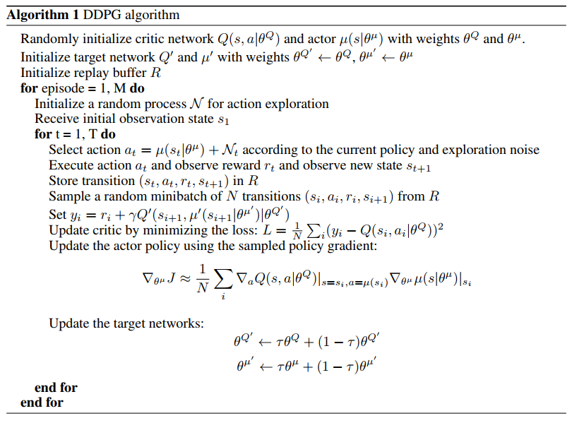
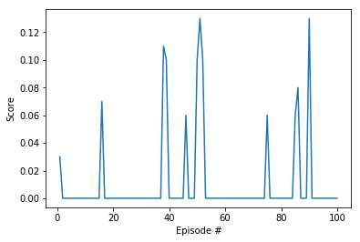

# Report
###  Learning Algorithm

### Hyperparameters

For the above algorithm, the hyperparameters are:

- Replay memory buffer size R = 100,000
- Minibatch size N = 200
- Discount factor Gamma = 0.99
- Maximum number of episodes M = 2000
- Soft update of target parameters factor TAU = 0.001
- Actor Learning rate = 0.0001
- Actor Learning rate = 0.001
- L2 weight decay factor = 0.0001

###  Model Architectures

There are two neural networks in this model,  actor network and critic network.

The actor network consists of one hidden layer and one output layer. The hidden layer has input size of 33(size of state) and output size of 256, the output layer has input size of 256 and output size of 4(size of action). The hidden layer has relu function as its activation, and the output layer has hyperbolic tangent activation function.

The critic network consists of three hidden layers and one output layer. The first layer has input size of 33(size of state) and output size of 256, the second layer concatenate the output of first layer and the action vector, which has input size of 260(256+4) and output size of 256, the third layer has input size of 256 and output size of 128, the output layer has input size of 128 and output size of 1. The three hidden layers all have leaky relu function as their activations, and the output layer has linear activation function.

### Plot of Rewards

The agent is not able to learn from the environment

### Ideas for Future Work

- Use 20 agents instead of one agent. The parallel training regime can result in faster and more stable agents
- Try other algorithms such as Proximal Policy Optimization (PPO), Trust Region Policy Optimization (TRPO) and Truncated Natural Policy Gradient (TNPG), and Distributed Distributional Deterministic Policy Gradients (D4PG) to see whether they can yield better performance
